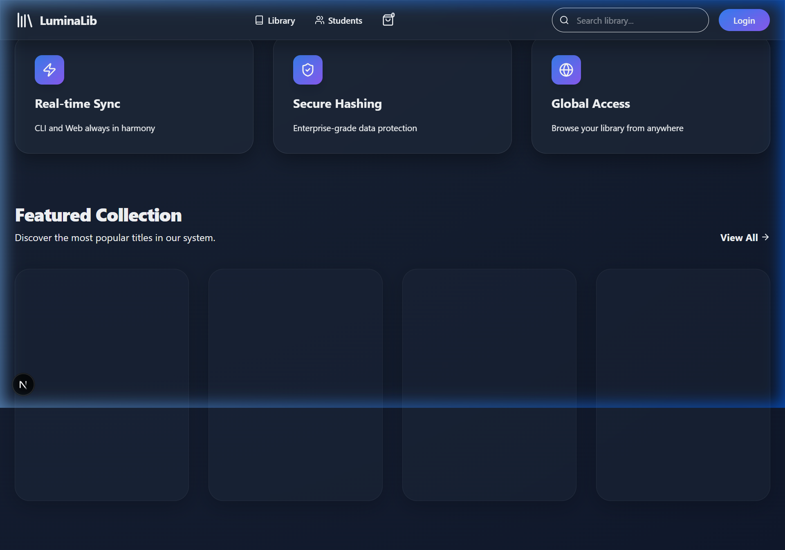
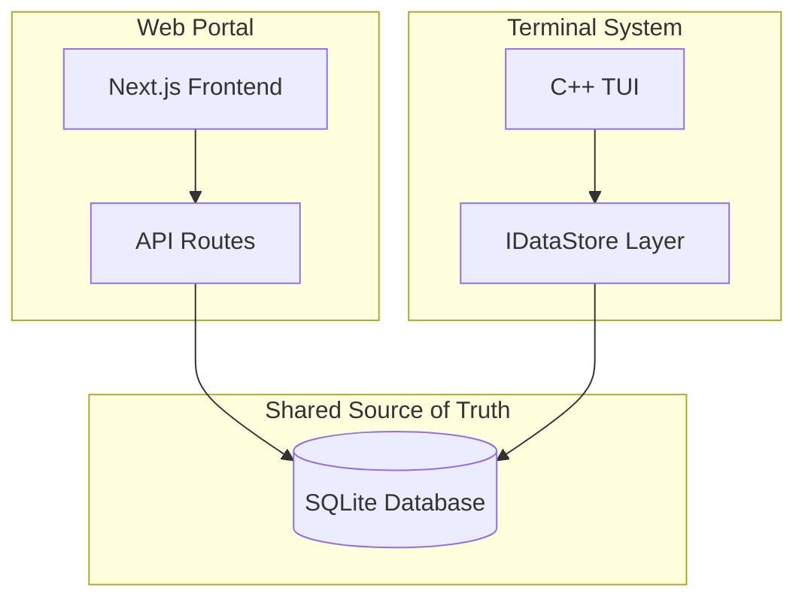

# 🌟 LuminaLib | Enterprise Library Management System

LuminaLib is a state-of-the-art, cross-platform library management ecosystem that bridges the power of C++ with the elegance of a modern web experience. Built for institutions that demand high performance, security, and a premium user experience.



## 🚀 Key Features

### 🖥️ High-Performance C++ CLI
- **Vibrant TUI**: Color-coded terminal interface for lightning-fast administrator operations.
- **Expert Architecture**: Decoupled Data Access Layer (DAL) featuring an abstract interface for infinite persistence flexibility.
- **Enterprise Security**: Argon-style hashing for all sensitive credentials (Student & Admin).

### 🌐 Premium Next.js Web Portal
- **Scale-Ready**: High-volume book discovery subsystem optimized for **10,000+ titles**.
- **Real-time Synchronization**: Unified SQLite core ensures CLI and Web data stay in perfect harmony.
- **Student Dashboard**: One-click **Online Booking**, secure Login/Signup, and fine tracking.
- **Glassmorphism UI**: Cutting-edge, Awwwards-standard design using Next.js 15 and Tailwind CSS 4.

## 🛠️ Technology Stack
- **Core**: Modern C++ (C++14)
- **Persistence**: SQLite (Shared Database Core)
- **Web Frontend**: Next.js 15 (App Router), TypeScript, Tailwind CSS 4
- **Web Backend**: Next.js API Routes (Serverless-ready)
- **UI Library**: Lucide React, Clsx, Glassmorphism Framework

## ⚙️ Installation & Usage

### 🖥️ Running the CLI Base
1. Ensure `g++` is in your environment PATH.
2. Run the build script:
   ```bash
   .\compile.bat
   ```
3. Launch the system:
   ```bash
   .\library_system.exe
   ```

### 🌐 Launching the Web Portal
1. Navigate to the `web/` directory:
   ```bash
   cd web
   ```
2. Install dependencies & launch:
   ```bash
   npm install
   npm run dev -- -p 3001
   ```
3. Access at: `http://localhost:3001`

## 🏗️ Technical Architecture



---
Developed with ❤️ by LuminaLib Team.
