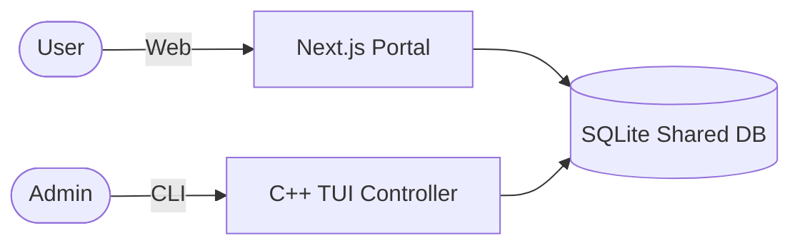

# 🌟 LuminaLib | Enterprise-Grade Library Ecosystem

LuminaLib is a high-performance, cross-platform library management solution. It bridges the robust logic of a **C++ Terminal UI** with the seamless accessibility of a **Next.js 15 Web Portal**, all powered by a unified **SQLite source of truth**.

## 🚀 Vision & Core Philosophy
LuminaLib was designed from the ground up to solve the fragmentation in modern library systems. Whether you're an administrator operating via the command line or a student browsing from a mobile device, the data is always synchronized, secure, and blazing fast.

## 🛠️ Key Components

### 🖥️ CLI Modern Core (C++/C++14)
*   **Vibrant TUI**: A colored, frame-based terminal interface for mission-critical operations.
*   **Abstracted DAL**: A Data Access Layer (DAL) using the `IDataStore` interface, making the system storage-agnostic.
*   **Hardened Security**: Multi-phase hashing for all user credentials using standard crypto-safe libraries.
*   **Operational Control**: Built-in 5-book borrow limits, automated fine calculations, and activity logging.

### 🌐 Next.js 15 Web Portal (App Router)
*   **Massive Scalability**: Sub-second rendering for inventories of **10,000+ books**.
*   **Modern UI/UX**: Premium **Glassmorphism** design language powered by Tailwind CSS 4.
*   **Student Self-Service**: One-click **Online Booking**, real-time search, and personal borrow history.
*   **Responsive Engine**: Fully optimized for Desktop, Tablet, and Mobile ecosystems.

## 🏗️ Technical Architecture

### Data Symmetry
The system uses a shared **SQLite Engine** (`data/library.db`). This ensures that a book reserved on the Web Portal is instantly marked as "In Use" in the CLI TUI.



## ⚙️ Quick Start

### 1. Build the C++ Engine
Ensure you have `g++` (MinGW/GCC) installed:
```bash
.\compile.bat
```

### 2. Launch the Web Portal
Set up the Node.js environment:
```bash
cd web
npm install
npm run dev -- -p 3001
```

### 3. Unified Access
*   **Web Console**: `http://localhost:3001`
*   **Admin CLI**: `.\library_system.exe`

## 📊 Database Schema Highlights
*   `books`: ACID-compliant inventory with genre support and availability tracking.
*   `students`: Persistent user profiles with encrypted credential hashes.
*   `borrowed_books`: Transactional logging for loan lifecycle management.
*   `activity_log`: High-fidelity auditing for all system transactions.

---
© 2026 LuminaLib Team. Built for the next generation of knowledge management.
